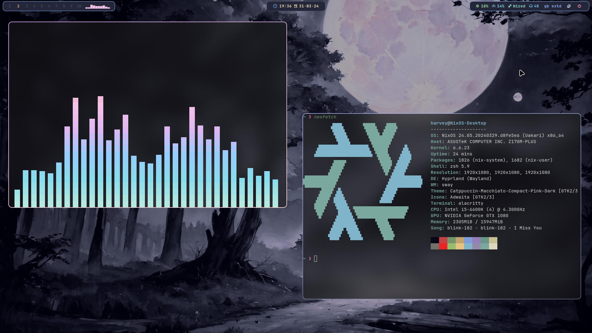

<h1 align="center">
    
   <br>
      My Nixos Config Based on Sly-Harvey's
   <br>
       <br>
   <div align="center">

   <div align="center">
      <p></p>
      <div align="center">
      </div>
      <br>
        </div>
   </div>
</h1>



# Install
> [!Note]
> <p>Default gpu drivers are nvidia.<br>
> If you want to change this then edit the imports in ./hosts/Default/configuration.nix.</p>
## Using the install script
```bash
nix run --experimental-features "nix-command flakes" nixpkgs#git clone https://github.com/Tetsorou/NixosDots.git ~/NixOS
```
```bash
cd ~/NixOS
```
```bash
sudo ./install.sh
```
## Building manually
> [!IMPORTANT]
> <p>When building manually from the flake make sure to place your hardware-configuration.nix in hosts/Default/<br>
> then change the username variable in flake.nix with your username!!<br>
> afterwards run the command below</p>
```bash
sudo nixos-rebuild switch --flake .#Default
```
